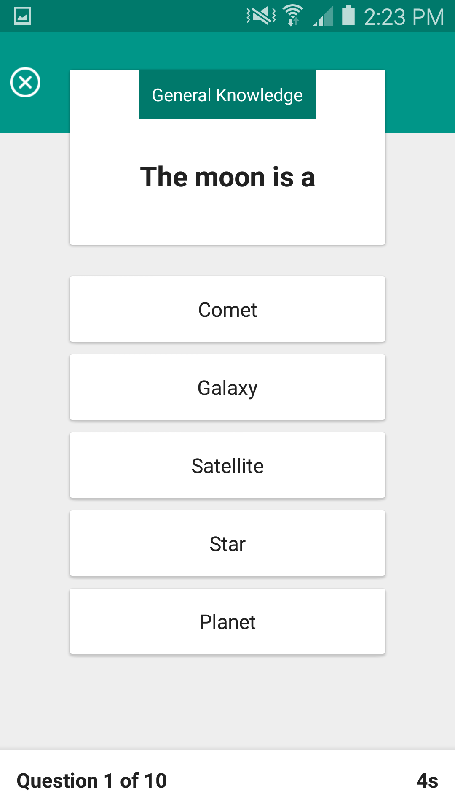
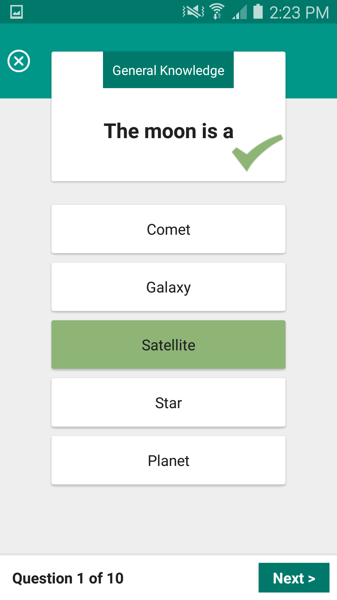
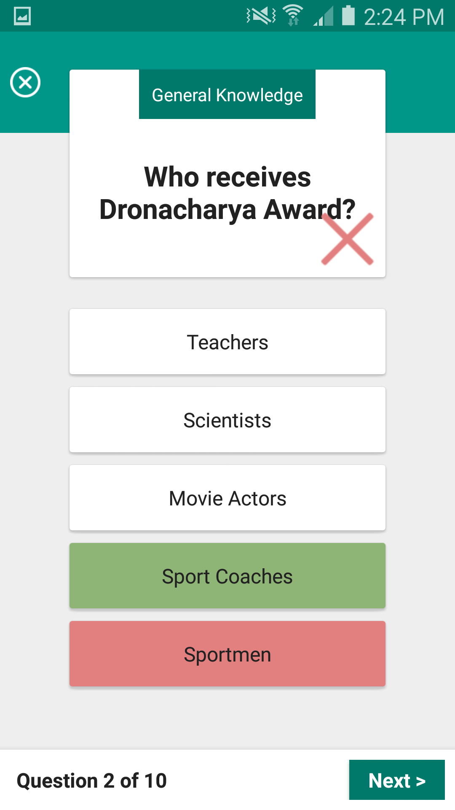
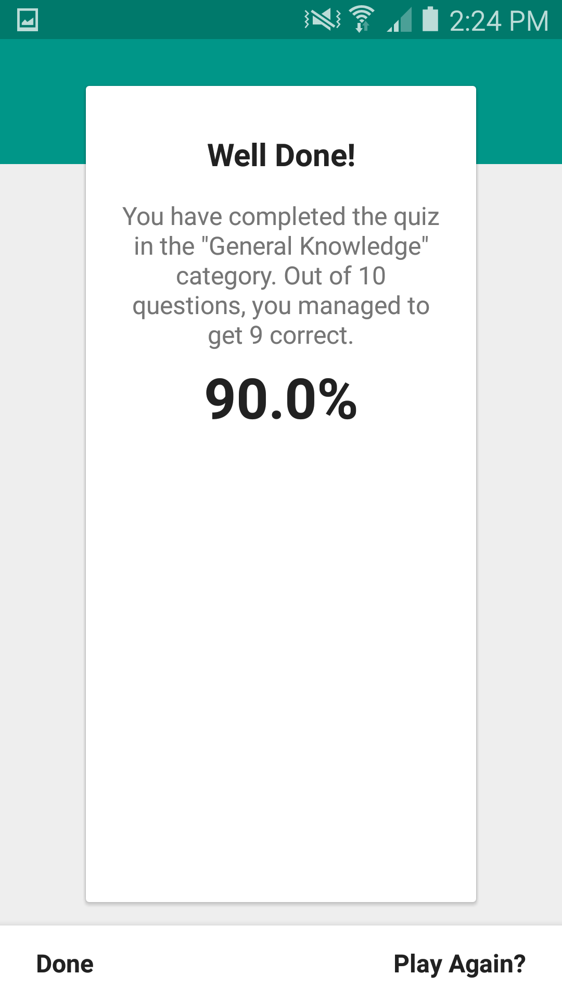

# PvZQuiz
A simple quiz game built with some specific requirements. Why is it called PvZQuiz? It's because i started playing Plant vs Zombie again while building this app.
* A single player quiz game
* A start screen that a user can start a new game
* 10 unique questions, each quiz question has 5 choices
* You have 10 seconds to answer each question
* Once quiz is completed, show a result page. Allow user to start a new game

# What is it made of?
* [Android Data Binding Library](https://developer.android.com/topic/libraries/data-binding/index.html) Binding of xml elements
* [MVVM Framework](https://en.wikipedia.org/wiki/Model–view–viewmodel) A framework that i'm using for the first time actually, which works quite well with data binding library.
* [Greenbot's EventBus](https://github.com/greenrobot/EventBus) to untangle message passing
* The usual material support library from Google
* The actual quiz questions are included in the project in the form a `.json` file under `/res/raw/quiz.json`

# How to run on your Android phone?
1. First, Clone this repo

2. In Terminal, go into the main folder
`cd /path/to/folder/PvZQuiz/`

3. Then build the a debug application and wait till completion
`./gradlew assembleDebug`

4. Ensure that you have the platform tools, especially the `adb` tool by downloading just the command line version from [Google's site](https://developer.android.com/studio/index.html) or direct link to mac version [here](https://dl.google.com/android/android-sdk_r24.4.1-macosx.zip).

5. Go to the platform tools folder
`cd /path/to/android-sdk-macosx/platform-tools/`

6. Ensure your Android phone is in debug mode. For example, see [here](https://www.kingoapp.com/root-tutorials/how-to-enable-usb-debugging-mode-on-android.htm).

6. Deploy debug build to your Android phone by 
`./adb -d install /path/to/PvZQuiz/app/build/outputs/apk/app-debug.apk`

Done

# Screenshots
||||||
|:-------------------------:|:-------------------------:|:-------------------------:|:-------------------------:|:-------------------------:|
